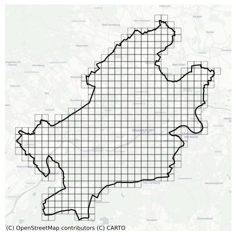
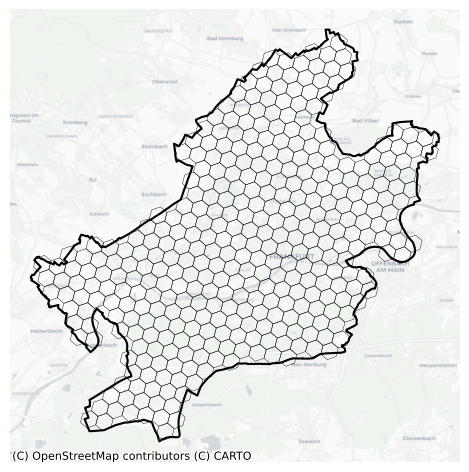
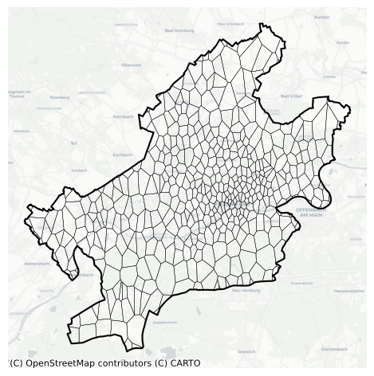
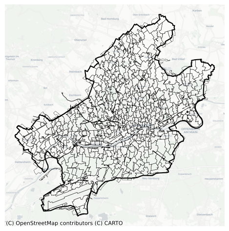

# tesspy


`tesspy` is a python library for geographical tessellation.

The process of discretization of space into subspaces without overlaps and gaps is called tessellation. Tessellation is essential in understanding geographical space and provides a framework for analyzing geospatial data. Different tessellation methods are implemented in `tesspy`. They can be divided into two groups. The first group is regular tessellation methods: square grid and hexagon grid. The second group is irregular tessellation methods based on geospatial data. These methods are adaptive squares, Voronoi diagrams, and city blocks. The geospatial data used for tessellation is retrieved from the OpenStreetMap database.


## Installation
You can install ``tesspy`` from PyPI using pip (**Not Recommended**):
```
pip install tesspy
```

and from conda (**Recommended**):
```
conda install -c conda-forge tesspy
```

## Dependencies

`tesspy`'s dependencies are: `geopandas`,`h3-py`,`osmnx`,`hdbscan`, and`mercantile`.


## Creating a new environment for tesspy

`tesspy` depends on `geopandas`, which could make the installation sometimes tricky because of the conflicts with the current packages. Therefore, we recommend creating a new clean environment and installing the dependencies from the conda-forge channel.


Create a new environment:
```shell
conda create -n tesspy_env -c conda-forge
```

Activate this environment:
```shell
conda activate tesspy_env
```

Install tesspy from conda-forge channel:
```shell
conda install -c conda-forge tesspy
```


## Documentation
The official documentation is hosted on **[ReadTheDocs](https://tesspy.readthedocs.io)**.


## Examples
The city of "Frankfurt am Main" in Germany is used to showcase different tessellation methods. This is how a tessellation object is built, and different methods are called. For the tessellation methods based on Points of Interests (adaptive squares, Voronoi polygons, and City Blocks), we use `amenity` data from the OpenStreetMap.
```python
from tesspy import Tessellation
ffm= Tessellation('Frankfurt am Main')
```


### Squares 
```python
ffm_sqruares = ffm.squares(resolution=15)
```


### Hexagons
```python
ffm_hex_8 = ffm.hexagons(resolution=8)
```



### Adaptive Squares
```python
ffm_asq = ffm.adaptive_squares(start_resolution=14, threshold=100, poi_categories=['amenity'])
```


### Voronoi Polygons
```python
ffm_voronoi = ffm.voronoi(poi_categories=['amenity'], n_polygons=500)
```


### City Blocks
```python
ffm_city_blocks = ffm.city_blocks(n_polygons=500)
```


## Contributing to tesspy
All kind of contributions are welcome: 
* Improvement of code with new features, bug fixes, and  bug reports
* Improvement of documentation
* Additional tests

If you want to contribute to code:
1. Fork the latest main branch
2. Create a dev environment: install dependencies and install tesspy in [develop mode](https://python-packaging-tutorial.readthedocs.io/en/latest/setup_py.html#develop-mode)
3. Write failing tests
4. Write new code
5. Run tests and make sure they pass
6. Update documentation
7. Pull Request

If you have any ideas or questions, feel free to open an issue.


## Acknowledgements
`tesspy` is the result of the research project [ClusterMobil](https://www.frankfurt-university.de/de/hochschule/fachbereich-1-architektur-bauingenieurwesen-geomatik/forschungsinstitut-ffin/fachgruppen-des-ffin/fg-neue-mobilitat/relut/forschungsprojekte-relut/clustermobil/) conducted by the [Research Lab for Urban Transport](https://www.frankfurt-university.de/en/about-us/faculty-1-architecture-civil-engineering-geomatics/research-institute-ffin/specialist-groups-of-the-ffin/specialist-group-new-mobility/relut/). This research project is funded by the state of Hesse and [HOLM](https://frankfurt-holm.de/) funding under the “Innovations in Logistics and Mobility” measure of the Hessian Ministry of Economics, Energy, Transport and Housing. [HA Project No.: 1017/21-19]

